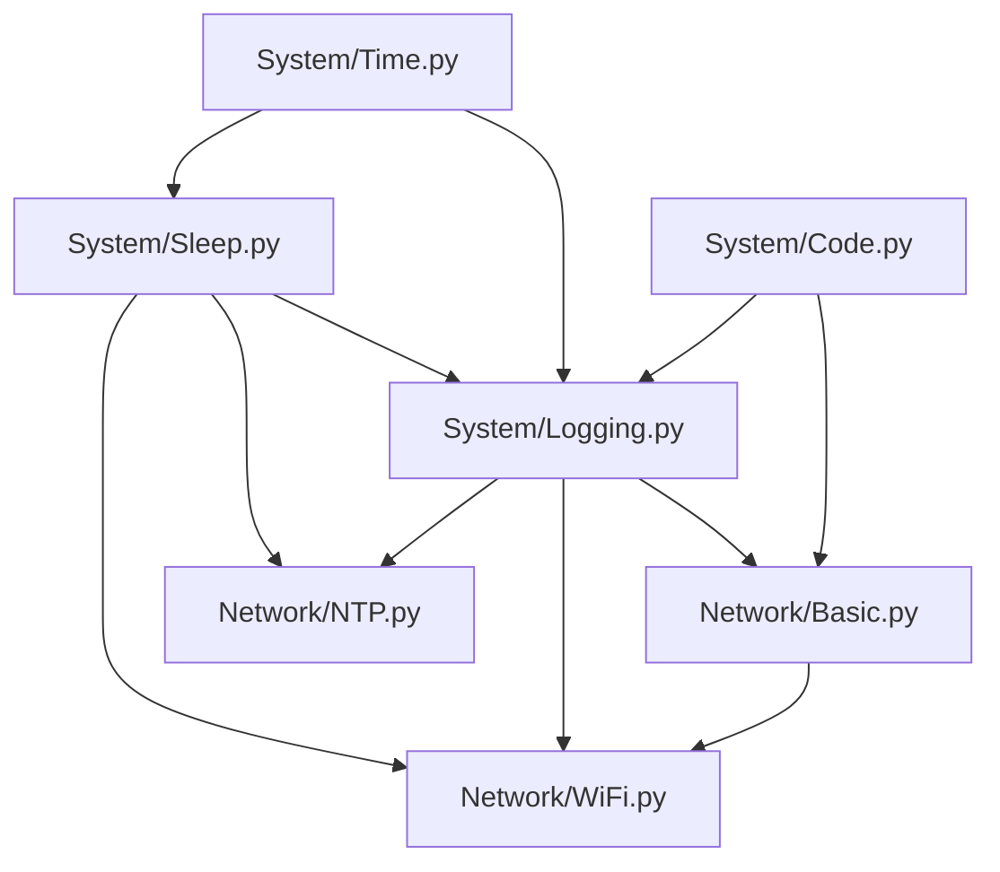

# MicroPython_ESP32_lib

A comprehensive utility library designed for MicroPython on ESP32 devices, providing essential system functionalities and robust network management capabilities. This library aims to simplify common tasks and offer a structured approach to developing embedded applications with MicroPython.

---

## Table of Contents

- [Features](#features)
- [Project Structure](#project-structure)
- [Installation](#installation)
- [Usage](#usage)
  - [System Utilities](#system-utilities)
    - [Logging](#logging)
    - [Time Management](#time-management)
    - [Sleep and Waiting](#sleep-and-waiting)
  - [Network Utilities](#network-utilities)
    - [WiFi Connection](#wifi-connection)
    - [NTP Synchronization](#ntp-synchronization)
- [Dependencies](#dependencies)
- [Compatibility](#compatibility)
- [Contributing](#contributing)
- [License](#license)

---

## Features

This library offers a modular set of tools to streamline MicroPython development:

### System Utilities

- **Time Management (`System.Time`)**: Provides functions for precise time retrieval (seconds, milliseconds, microseconds, nanoseconds), timezone handling, and RTC synchronization. Includes flexible time formatting options, including ISO8601.
- **Sleep & Waiting (`System.Sleep`)**: Offers synchronous and asynchronous sleep functions, along with utility functions (`sync_wait_until`, `async_wait_until`) to wait for conditions with timeouts.
- **Code Definitions (`System.Code`)**: A base class for defining named integer codes, used throughout the library for status and mode constants.
- **Logging (`System.Logging`)**: A flexible logging system supporting various levels (DEBUG, INFO, WARNING, ERROR, NONE), custom output handlers, and thread-safe logging for concurrent operations.

### Network Utilities

- **Basic Network Definitions (`Network.Basic`)**: Encapsulates common MicroPython `network` module constants (WLAN status, power management, interface modes) with robust fallback mechanisms for broader compatibility across different MicroPython versions/ports. Includes an `IPV4Address` class for structured IP handling.
- **WiFi Management (`Network.WiFi`)**: Provides classes (`Config`, `Connector`) to simplify WiFi activation, connection, disconnection, and configuration (including static IP, hostname, power management). Handles connection retries and comprehensive status monitoring.
- **NTP Synchronization (`Network.NTP`)**: Functions to synchronize the device's system time with NTP servers, including a retry mechanism for reliable time setting.

---

## Project Structure

The library is organized into `System` and `Network` modules, each containing related functionalities.

```text
\---src
    \---micropython_esp32_lib
        |   __init__.py
        |
        +---Network
        |       Basic.py
        |       NTP.py
        |       WiFi.py
        |       __init__.py
        |
        \---System
                Code.py
                Logging.py
                Sleep.py
                Time.py
                __init__.py
```

- `src/micropython_esp32_lib/`: The root package for the library.
  - `System/`: Contains core utilities like time, sleep, logging, and generic   code definitions.
  - `Network/`: Contains network-related functionalities, including basic   network constants, WiFi management, and NTP synchronization.
  - `old/`: (Not part of the active library) Contains historical or deprecated code versions.



---

## Installation

To use this library on your MicroPython ESP32 device, you can copy the `micropython_esp32_lib` directory from `src/` directly to your device's filesystem.

1. **Copy the `micropython_esp32_lib` folder**:
    Copy the entire `src/micropython_esp32_lib` directory to the `lib/` directory on your MicroPython device, or directly to the root of the filesystem if you prefer.

2. **Handle Relative Imports**:
    The library uses `try...except ImportError` blocks for imports (e.g., `from ..System import Logging` vs `from MicroPython_ESP32_lib.System import Logging`). This pattern allows the modules to be tested individually or run as part of the `MicroPython_ESP32_lib` package. When deploying to your device, ensure the `micropython_esp32_lib` package is correctly placed in a location where MicroPython can find it (e.g., `/lib/`). User scripts will typically use absolute imports like `from micropython_esp32_lib.System import Logging`.

---

## Usage

### System Utilities

#### Logging

Configure and use the flexible logging system:

```python
from micropython_esp32_lib.System import Logging

# Initialize a logger with a specific name and level
logger = Logging.Log("MyApplication", Logging.LEVEL.INFO)

# Log messages at different levels
logger.debug("This debug message won't be shown as the logger level is INFO.")
logger.info("Application started successfully.")
logger.warning("Something unexpected might be happening.")
logger.error("A critical error occurred, please investigate!")

# You can also change the default log handler (e.g., to a file handler)
# class FileHandler(Logging.LogHandler):
#   def __init__(self, filename):
#     self.file = open(filename, 'a')
#   def emit(self, record):
#     self.file.write(record + '\n')
#     self.file.flush() # Ensure data is written to disk
#
# Logging.Log.set_handler(FileHandler("app.log"))
# logger.info("This message will now be written to 'app.log'.")
```

#### Time Management

Work with precise time, timezones, and various formatting options:

```python
from micropython_esp32_lib.System import Time

# Get current time with the default timezone (UTC+0 initially)
current_time = Time.Time()
print(f"Current UTC time: {current_time}")

# Set a custom global timezone (e.g., UTC+8 for Shanghai/Beijing)
Time.setTimezone(8)
current_local_time = Time.Time()
print(f"Current local time (UTC+8): {current_local_time}")

# Format time in ISO8601 with milliseconds
iso_time_ms = Time.Time(format=Time.TimeFormater.ISO8601_MS)
print(f"ISO8601 (ms): {iso_time_ms}")

# Get raw time values with timezone applied
print(f"Current seconds: {Time.current_s()}")
print(f"Current milliseconds: {Time.current_ms()}")
print(f"Current nanoseconds: {Time.current_ns()}")

# Example of setting the Real-Time Clock (RTC)
# Note: RTC functionality can vary significantly between MicroPython boards.
# Time.setRTC(Time.make_s(year=2025, month=1, day=1, hour=12, minute=0, second=0), timezone=8)
# print(f"RTC set. New time: {Time.Time()}")
```

#### Sleep and Waiting

Control program execution flow with synchronous and asynchronous delays and conditional waiting:

```python
from micropython_esp32_lib.System import Sleep
from micropython_esp32_lib.System import Time

# Synchronous sleep for a specified duration
print(f"[{Time.Time()}] Sleeping for 2 seconds synchronously...")
Sleep.sync_s(2)
print(f"[{Time.Time()}] Woke up after 2 seconds.")

# Synchronous wait until a condition is met, with a timeout
print(f"[{Time.Time()}] Waiting for 5 seconds using sync_wait_until...")
start_s = Time.current_s()
# This will wait until 5 seconds have passed, or timeout after 10 seconds
condition_met = Sleep.sync_wait_until(lambda: Time.current_s() >= start_s + 5, timeout_ms=10000, interval_ms=500)
if condition_met:
    print(f"[{Time.Time()}] Finished waiting: condition met.")
else:
    print(f"[{Time.Time()}] Finished waiting: timeout occurred.")

# Asynchronous sleep (requires an asyncio event loop)
# import asyncio
# async def main():
#   print(f"[{Time.Time()}] Async sleeping for 1 second...")
#   await Sleep.async_s(1)
#   print(f"[{Time.Time()}] Async woke up.")
#
# asyncio.run(main())
```

### Network Utilities

#### WiFi Connection

Connect to a WiFi network with robust configuration and status handling:

```python
from micropython_esp32_lib.Network import WiFi
from micropython_esp32_lib.System import Logging

logger = Logging.Log("WiFi Example", Logging.LEVEL.INFO)

# Define WiFi configuration
wifi_config = WiFi.Config(
    ssid="YOUR_WIFI_SSID",
    password="YOUR_WIFI_PASSWORD",
    hostname="ESP32-MicroPython-Device",
    # Optional: Configure power management for energy saving
    # pm=WiFi.NetworkBasic.PM.POWERSAVE,
    # Optional: Static IP configuration
    # hostAddress=WiFi.NetworkBasic.IPV4Address("192.168.1.100"),
    # subnet=WiFi.NetworkBasic.IPV4Address("255.255.255.0"),
    # gateway=WiFi.NetworkBasic.IPV4Address("192.168.1.1"),
    # dns=WiFi.NetworkBasic.IPV4Address("8.8.8.8")
)

# Initialize WiFi connector
wifi_connector = WiFi.Connector(log_level=Logging.LEVEL.INFO)

# Connect to WiFi with a timeout and retry mechanism
if wifi_connector.connect(wifi_config, timeout_ms=20000, retry_count=10, retry_interval_ms=1000):
    logger.info("Successfully connected to WiFi!")
    logger.info(f"Device IP: {wifi_connector.getIPV4Address()}")
    logger.info(f"Hostname: {wifi_connector.getHostname()}")
    # You can now perform network operations (e.g., fetch data, connect to a server)
    
    # Example: Disconnect when network operations are complete
    # if wifi_connector.disconnect():
    #     logger.info("Disconnected from WiFi.")
else:
    logger.error("Failed to connect to WiFi after multiple attempts.")

```

#### NTP Synchronization

Synchronize the device's system time using an NTP server:

```python
from micropython_esp32_lib.Network import NTP
from micropython_esp32_lib.System import Logging
from micropython_esp32_lib.System import Time
from micropython_esp32_lib.Network import WiFi # Assuming WiFi is needed for network access

logger = Logging.Log("NTP Example", Logging.LEVEL.INFO)

# --- Prerequisite: Ensure WiFi is connected ---
# (You would typically have WiFi connection code here, similar to the example above)
# For demonstration, let's assume WiFi is already connected.
# In a real application, you'd call wifi_connector.connect(...) first.
# Example:
# wifi_config = WiFi.Config(ssid="YOUR_WIFI_SSID", password="YOUR_WIFI_PASSWORD")
# wifi_connector = WiFi.Connector(log_level=Logging.LEVEL.INFO)
# if not wifi_connector.connect(wifi_config, timeout_ms=20000):
#     logger.error("NTP sync aborted: WiFi not connected.")
#     # Handle WiFi connection failure
# else:
#     logger.info("WiFi connected, proceeding with NTP sync.")
# --- End Prerequisite ---

# Synchronize time with an NTP server, with retries
if NTP.sync_with_retry(ntp_host="pool.ntp.org", retries=5, delay_ms=1000):
    logger.info("NTP synchronization successful!")
    logger.info(f"Current time after NTP sync: {Time.Time()}")
else:
    logger.error("NTP synchronization failed after multiple retries.")
```

---

## Dependencies

This library relies on standard MicroPython modules, which are typically built into the firmware:

- `network`
- `utime`
- `machine`
- `ntptime`
- `asyncio` (for asynchronous sleep functions)
- `_thread` (optional, for thread-safe logging; falls back to a mock implementation if not available)

---

## Compatibility

This library is primarily developed and tested for **MicroPython on ESP32** devices. While some modules might work on other MicroPython ports, full compatibility is not guaranteed due to hardware-specific implementations (e.g., `machine.RTC`, variations in the `network` module's constants and methods)

---

## Contributing

Contributions are welcome! If you find a bug, have a feature request, or want to improve the code, please feel free to open an issue or submit a pull request on the project's repository

---

## License

This project is licensed under the MIT License. A copy of the license can typically be found in the `LICENSE` file at the root of the repository.
